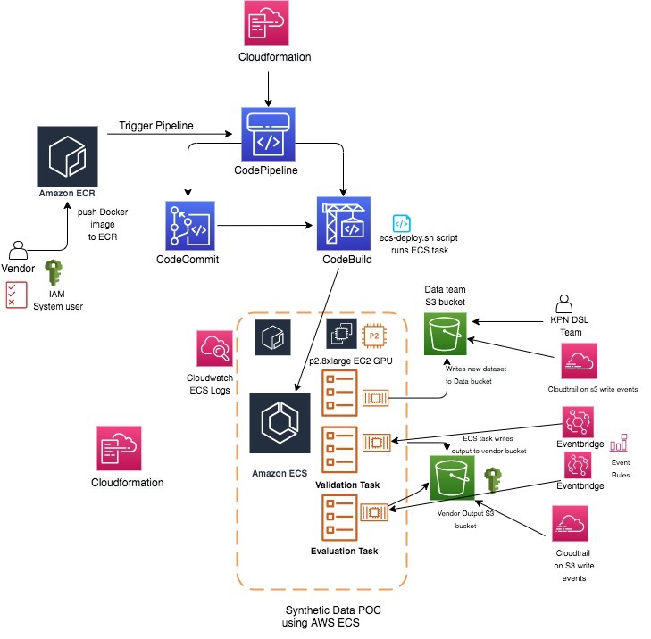

# syn-pipeline-ecs-codepipeline
Build a data synthetic pipeline using ECS, Eventbridge &amp; Codepipeline for a Data Science Team.

)

## Provisioned Infrastructure

*EC2 GPU On-demand instance
*p2.8x large instance (8 NVIDIA K80 GPU, 32 vCPUs, 488 GiB RAM, $7.2 hr per hour)
*KPN VPC with Private Subnets (AWS Account : kpn-nonprod-dsl)
*AWS ECS (Elastic Container Service) - EC2 launch type with awsvpc ENI ECS task networking; private IP addresses
*ECS Tasks with maximum CPU of 10240 CPU units ( 10 vCPUs) and 100 GB memory per task
*IAM System user for Vendor
*S3 Buckets ( output-vendor-bucket and data-team-bucket)
*Cloudwatch logs access for vendors
*Cloudformation for provisioning of resources
*CodePipeline for CI/CD - gets triggered on a new docker image push to ECR
*Eventbridge(event rules) & Cloudtrail - The event rules, trigger the ECS validation and evaluation script.
*ECR for Docker Image Repository
*Custom ecs-deploy.sh script in Codebuild that updates the task definition and launches the ECS task